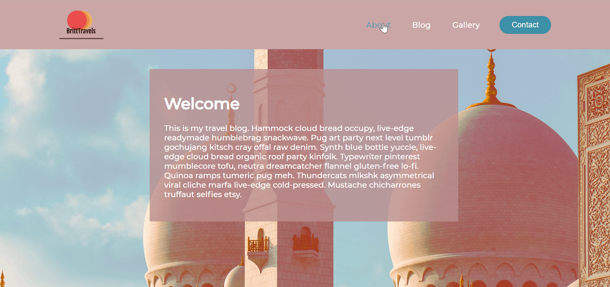
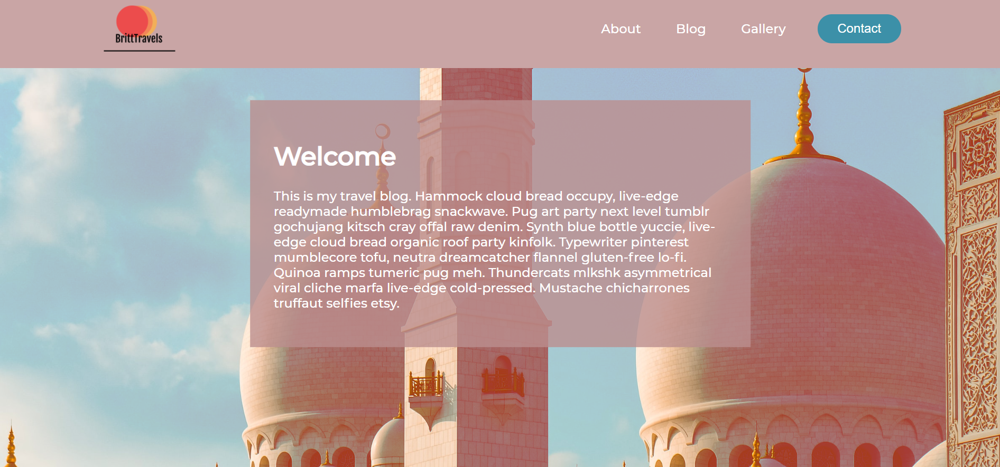

# Description :
A landing page for a travel blog with responsive navbar and a background image styled with blend mode. 

# Preview :

# Resources :
* Unsplash
* Coolers
* Hipsum.co
* [FreeLogoDesign](https://www.freelogodesign.org/)
* Skillthrive Navbar CSS Tutorial : [3 Ways to Create a Navigation Bar with Flexbox](https://youtu.be/PwWHL3RyQgk)
* Kevin Powell Tutorial : [CSS Blending Modes](https://youtu.be/-c94pr41jaI)

